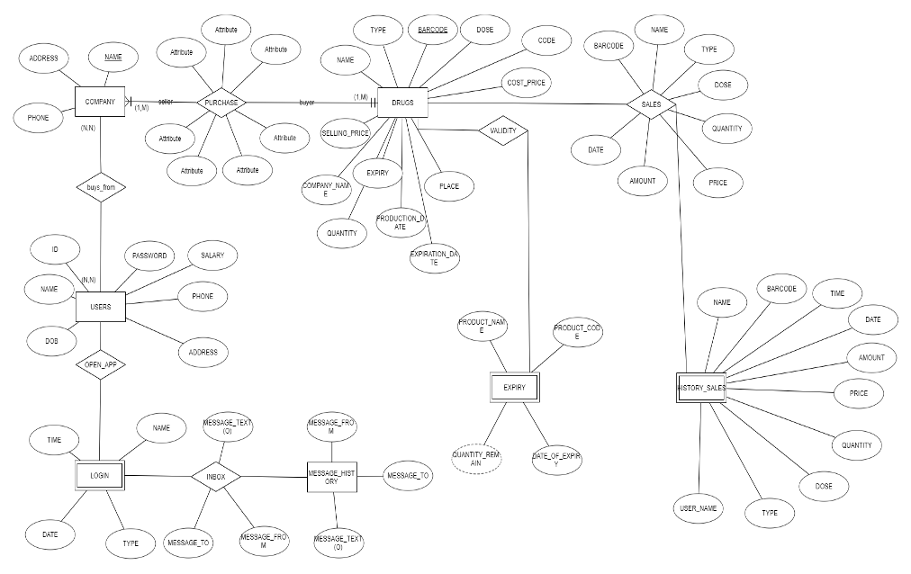
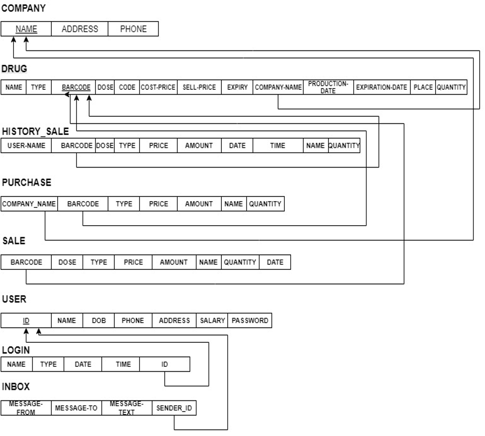

Pharmacy-Management-System

How to run the Project:
1. Clone this repo using 
   - `git clone https://github.com/Doetheman/phar_sql_project.git`
2. Install Eclipse J2EE or any other IDE of your choice.
3. Use WAMP or XAMPP or any server of your choice.
4. First create the MySql database on WAMP server using the sql file in the repo
5. And then build and run the project from the IDE. 

Login Information <br>
 ```
 id :1
 password: admin 
 ```
 note: The login information can be changed while setting up MySQL or via UI later
 
# INTRODUCTION: <br>
The main aim of the project is the management of the database of the pharmaceutical shop. This project is insight into the design and implementation of a Pharmacy Management System. This is done by creating a database of the available medicines in the shop. The primary aim of pharmacy management system is to improve accuracy and enhance safety and efficiency in the pharmaceutical store. The aim of this project is to develop software for the effective management of a pharmaceutical store. We have developed this software for ensuring effective policing by providing statistics of the drugs in stock. 

Architecture Description <br>
ER Diagram



 
Schema Diagram




The goal of this application is to manage the medicines and various function of the pharmacy. <br><br>
**List of modules:**<br>
o	Login page<br>
o	Home page<br>
o	Company<br>
o	Purchase<br>
o	Drugs<br>
o	Sales<br>
o	User/Settings<br>
o	Messaging<br>


